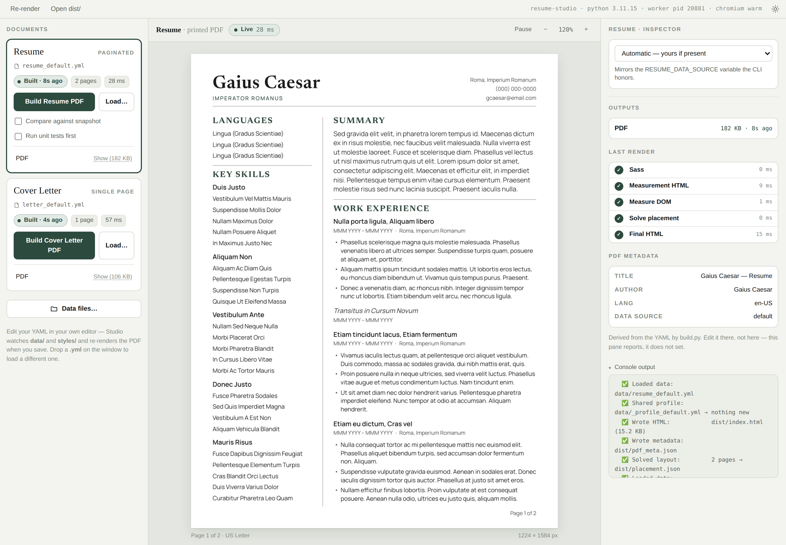
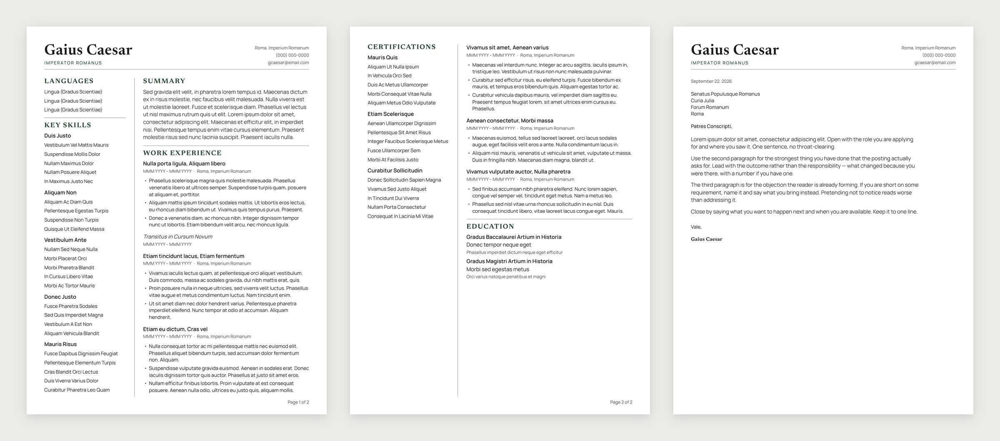
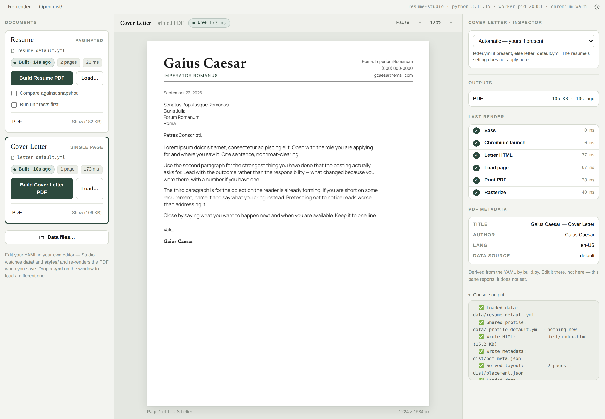

# Resume Studio

[](https://github.com/Vesselchuck/resume-studio/actions/workflows/tests.yml)
[](https://github.com/Vesselchuck/resume-studio/releases/latest)
[](LICENSE)

A desktop app for your resume and cover letter. You write both in YAML,
in whatever editor you like; the Studio shows the **real printed PDF**
every time you save, and builds a pixel-faithful US Letter PDF that
prints correctly in color and in black and white. Page breaks are
worked out for you, and the cover letter reuses the resume's header so
the two read as a set.

What changed and when — including anything that makes an old data file
stop working — is in [CHANGELOG.md](CHANGELOG.md).

<picture>
  <source media="(prefers-color-scheme: dark)" srcset="docs/screenshots/studio-dark.png">
  
</picture>

<picture>
  <source media="(prefers-color-scheme: dark)" srcset="docs/screenshots/documents-dark.png">
  
</picture>

All screenshots show the placeholder data the project ships with
(`data/*_default.yml`).

## Getting started

### Requirements

- **Python** 3.10+ (tested on 3.10 and 3.12; CI runs 3.11).
- **Node** 18+ (for Playwright 1.60).
- **Rust** (stable, installed with [rustup](https://rustup.rs/)) for the
  desktop window. On Windows, Rust also needs the Microsoft C++ Build
  Tools, which the rustup installer offers to set up. No Rust? The same
  app runs in your browser — see below.
- **Chromium** for Playwright, installed in the setup step.

Every direct dependency is exact-pinned in `requirements.txt`, and
every Node package in `package-lock.json`.

### One-time setup

In the project folder:

```powershell
# Windows (PowerShell or cmd.exe)
py -m pip install -r requirements.txt
npm ci
npx playwright install chromium
```

```bash
# macOS / Linux
pip install -r requirements.txt
npm ci
npx playwright install chromium
```

Use `npm ci`, not `npm install`: it installs exactly what
`package-lock.json` says and fails if `package.json` disagrees with it.

### Open the Studio

On Windows, double-click **`studio.bat`** in the project folder. From a
terminal, on any platform:

```
npm run studio
```

The first start compiles the desktop shell and takes a few minutes;
later starts take seconds. The console window stays open while the app
runs, and closing it stops the app.

Without a Rust toolchain, open the same app in your browser instead:

```
npm run ui
```

| Command                | Does                                               |
|------------------------|----------------------------------------------------|
| `npm run studio`       | The desktop app (also: double-click `studio.bat`)  |
| `npm run ui`           | The same app in your browser — no Rust needed      |
| `npm test`             | Run the full test suite                            |
| `npm run studio:build` | Compile the desktop app to an installer (see below) |

The installer is not standalone yet: the installed app still needs
Node, Python and the packages from the setup step, and it keeps
`data/` and `dist/` in its install folder, which is often read-only.
Until that changes, run the app from the project folder with
`npm run studio`.

The Studio finds the right Python interpreter by itself. If that ever
fails (the usual cause is the Microsoft Store `python` alias on
Windows), set `PYTHON` before starting it — see the FAQ.

## Using the Studio

A three-pane window: your documents on the left, the **real printed
PDF** in the middle, an inspector on the right. Edit the YAML in
whatever editor you like and the pane follows.

<picture>
  <source media="(prefers-color-scheme: dark)" srcset="docs/screenshots/studio-letter-dark.png">
  
</picture>

The preview is not a screenshot of the HTML. It prints a real PDF,
sets the same US Letter page boxes `crop_pdf.py` sets, and rasterizes
it with the same function the visual-regression test uses — so what
you see is the output, post-crop, at true 612 × 792 pt. The preview
sets the boxes in memory instead of rewriting the file (the rewrite
took longer than printing); a Build still crops the file itself and
stamps its metadata, and a test checks the two give the same pixels.

**Build** writes the finished PDF to `dist/`. It runs the same build
scripts (`resume.js`, `letter.js`) that the command line uses for
debugging, so there is exactly one way to produce a PDF worth sending,
and building the resume cannot touch the cover letter's files. There is
nothing to choose: each document builds one PDF.

Each card chooses its own data file. The cover letter reads the file
picked on its card, or else `data/letter.yml`, or else
`data/letter_default.yml`; the resume card's choice never changes it,
and the reverse. Data-file variables set in the shell that started the
Studio (`RESUME_DATA_FILE` and the rest) are ignored, so the card
always names the file the preview and the build read.

Two checkboxes on the resume card:

| Checkbox | Default | Effect |
|----------|---------|--------|
| Compare against snapshot | off | Runs the pixel diff and reports differences. Never blocks. |
| Run unit tests first     | off | Runs the full suite before building — about a minute. See "Why the tests can be skipped". |

**Dropping a file** works out which document it is by reading it, not
by its name: the two builders require disjoint top-level keys
(`sidebar`/`mainColumn` versus `letter`), so a file that satisfies one
cannot satisfy the other. If it matches both or neither, the app asks
instead of guessing. Nothing in `data/` is ever overwritten — a
dropped file is read in place if it is already there, saved under its
own name if not, and a name collision offers you a choice rather than
replacing anything. A file whose name starts with `_` is refused:
those names are reserved for the shared profile.

## Editing your resume

**`data/resume.yml` is yours.** It is gitignored, and the Studio prefers
it over everything else. `data/resume_default.yml` is the placeholder
the repo ships (Gaius Caesar) so a fresh clone still builds; it is the
one that is committed.

The unsuffixed name belongs to the real document on purpose: the file
you edit every week should have the obvious name, and the one you touch
once should carry the qualifier.

Starting from the template, copy it to your own file:

```powershell
# Windows (PowerShell)
Copy-Item data\resume_default.yml data\resume.yml
```

```bash
# macOS / Linux
cp data/resume_default.yml data/resume.yml
```

Then open `data/resume.yml` in your editor. The Studio switches to it by
itself and re-renders the preview on every save. (**Data files…** in the
Studio lists everything in `data/`, and you can also drop a `.yml` file
onto the window.)

The PDF metadata manifest records which data source was used —
`default` for the template, `mine` for `data/resume.yml`, `explicit`
for any other file — so the snapshot test picks the matching fixtures,
or skips the check for an `explicit` file, which has none.

### The shared profile

`data/_profile.yml` holds what is true of you regardless of which job
you are applying for — your name, your contact details, the document
language and the page ceiling. Every build merges it **underneath** the
document it is building.

Your document always wins: anything it sets for itself is used, and the
profile only fills in what the document leaves out. So a phone number
lives in one file instead of one per application.

Mappings merge key by key: a document that sets only `contact.rows`
keeps the profile's `contact.address`. Lists are replaced, not
combined. A key left empty in the document (`contact:` with nothing
under it) counts as not set, so the profile's value is used.

Nothing references the profile by name. It applies to every `.yml`
beside it in `data/` simply by being there, and the build says so on
every run:

```
✅ Shared profile:        data/_profile.yml → contact, meta.lang, meta.maxPages, name
```

That line is the whole reason an implicit merge is acceptable: a value
can reach the PDF from a file the document never mentions, so the build
states which ones did, every time.

| Belongs in the profile | Belongs in each document |
|------------------------|--------------------------|
| `name`                 | `role` — names the job you are applying for |
| `contact`              | `meta.description` — names it too |
| `meta.lang`            | everything under `sidebar` / `mainColumn` / `letter` |
| `meta.maxPages`        | a `maxPages` override, if one document needs more room |

To turn the whole mechanism off, delete `data/_profile.yml`. Every
document still carries whatever it carries — though one you have
already stripped will be missing a name until you put one back.

`data/_profile_default.yml` is the shipped starting point; copy it to
`data/_profile.yml` and edit that.

**The templates never see your profile.** `resume_default.yml` and
`letter_default.yml` merge `_profile_default.yml`; only your own files
merge `_profile.yml`. The committed snapshot fixtures are rendered from
the templates, so if a template could borrow from your profile, your
phone number could end up in a file that goes to the repository.
`build.profile_for` decides which profile a document gets, by whether
its file name ends in `_default`.

## Editing your cover letter

The cover letter works exactly like the resume: copy the template to
your own file, select **Cover Letter** in the Studio, and edit. Yours is
`data/letter.yml` (gitignored); `data/letter_default.yml` is the shipped
placeholder.

```powershell
Copy-Item data\letter_default.yml data\letter.yml
```

It reproduces the resume's header verbatim so the pair matches, and
draws `name` and `contact` from the same `_profile.yml` the resume
uses — which is how the two stay in sync.

### There are only two fields

`letter.body` and `letter.recipient`. That is the whole letter.

**`body`** is the entire letter, greeting and sign-off included. Write
it as one block (paste paragraphs separated by a blank line) or as a
list, one entry per paragraph; `**bold**` works just like resume
bullets.

```yaml
letter:
  recipient: |
    Hiring Team
    Acme Corp
    100 Main St
    Springfield, IL 62701

  body: |
    Dear Hiring Team,

    One sentence naming the position and where you saw it.

    The strongest thing you have done that the posting asks for.

    Sincerely,
```

"Dear Hiring Team," and "Sincerely," are paragraphs like any other.
They used to be `salutation` and `closing` fields, which meant three
places to edit one letter and two of them easy to forget.

**`recipient`** takes a block too — paste an address straight out of a
job posting. It splits on **every** line, not on blank ones the way
`body` does: an address line is not a paragraph, and "Acme Corp" and
"100 Main St" must not be glued together. Blank lines in what you
pasted are dropped. The list form still works.

**Your name** under the sign-off is not in this file at all. It comes
from `name` in `data/_profile.yml`, the same place the resume gets it,
so it is right on every letter without being written on any of them.

A `salutation:`, `closing:` or `signature:` left in an old file is
rejected with the line to write instead — silently ignoring one would
drop the greeting off the letter without a word.

Output: `dist/Gaius_Caesar_Cover_Letter.pdf`.

### The build refuses a letter that does not fit

`.page` is a fixed 8.5 × 11in box with `overflow: hidden`. The resume
never meets that limit because its solver decides in advance what goes
on each page; the letter is one fixed sheet by design and has no
solver. So a letter that runs long is not spilled onto a second page —
it is **clipped**, and the closing paragraph and your signature come
off the bottom while the build reports success.

`verifyLetterFits` in `build/pipeline.js` stops that. It fails the
build and says how far over you are:

```
❌ The letter does not fit on one page
   It runs 138px past the bottom margin — roughly 7 lines of text.
```

It measures the letter's last child, not `.letter` itself: `.letter`
is a flex item with `flex: 1 1 auto` and `min-block-size: 0`, so its
own bottom edge sits on the page's content bottom no matter how long
the letter is. Measured that way the overflow is always exactly zero —
a check that looks like it passes and tests nothing.

### Letter typography

Three things are set on `.letter-body p` and nowhere else:

- `hyphens: none` — a formal letter read once shouldn't break words.
- `text-wrap: pretty` — avoids a single word alone on a last line.
  Ignored by renderers that don't support it, which is the right
  failure mode.
- `orphans: 2; widows: 2`, plus `break-before: avoid` on the
  signature so a name never lands alone at the top of a page.

They are deliberately **not** in `_base.scss`. The resume's solver
measures rendered block heights and then decides pagination from those
numbers, so anything that moves a line break moves the numbers it
solves from — and the committed pixel fixtures with them. The letter
has no solver, so it can ask for better line breaking. Nothing here
changes type size, weight, color or rhythm, so the two documents still
look like a pair.

The greeting and the sign-off keep the air they had as separate
fields, restored structurally:

```scss
.letter-body p:first-child { margin-block-end:   calc(var(--sp-xl) - var(--sp-lg)); }
.letter-body p:last-child  { margin-block-start: calc(var(--sp-xl) + var(--sp-sm) - var(--sp-lg)); }
```

16px above the body and 22px above the sign-off — the old `.letter`
gap, and the old `.letter-signoff` gap including its `--sp-sm` nudge.
Written as the arithmetic rather than as literals so they follow the
spacing scale if it is retuned.

### The date is not in the YAML

There is no `letter.date` field. The build stamps the day it runs,
because that is the only date a cover letter can carry honestly: a date
you typed is correct on the day you typed it and quietly wrong every
day after, and the reader most likely to notice is the one deciding
whether to interview you.

How it is written follows `meta.lang`:

| `meta.lang`                          | printed as           |
| ------------------------------------ | -------------------- |
| `en-US` (and bare `en`)              | `September 20, 2026` |
| `en-GB`, `en-AU`, `en-IE`, `en-IN`, … | `20 September 2026`  |
| anything not English                 | `2026-09-20`         |

`en_GB` is read as `en-GB`, and the regions `150` (Europe) and `001`
(world) are day-first too. Anything after a private-use `x-` is not a
region, so `en-x-gb` prints the US form.

The ISO fallback is deliberate. Printing "September" to a reader of
German or Japanese would be worse than printing the one format every
locale reads correctly, and this project has no translated month names.
The month names it does have are written out in `build_letter.py`
rather than taken from `strftime("%B")`, which consults `LC_TIME` — so
the same data file builds the same letter on every machine.

The rendered HTML carries both forms: `<time datetime="2026-09-20">`
around the printed text.

A `date:` left in an old `letter.yml` is **rejected**, not ignored —
the build stops and tells you to delete the line. Silently ignoring it
would leave you editing a line with no effect and finding out from a
letter dated differently to the file that made it.

## What you can change in the YAML

- **Personal info** — `name.first`, `name.last`, contact details.
- **Sidebar blocks** — add, remove, reorder under `sidebar.blocks`.
  Each block has a kebab-case `id` (must be unique), a `type`
  (`details` or `list`), a `heading`, and content. The first block
  with `id: key-skills` (or heading "Key Skills") drives the PDF's
  /Keywords metadata. A block needs at least one entry: a heading
  with nothing under it is refused.
- **Main column sections** — exactly one each of `summary`,
  `experience`, `education`. Add/remove jobs under
  `mainColumn[experience].jobs`. A job's `datetime` and an education
  entry's `subtitle` and `institution` are optional; leave one out and
  that line is simply not printed. A gap entry (`gap: true`) has no
  bullets.
- **Bullets** — add or remove freely under each job's `bullets:` list.
  Bullets support `**bold**` markdown; everything else is treated as
  plain text. The layout solver decides where page breaks land.
  Quote a bullet that contains a colon followed by a space —
  `- "Led the migration: cut costs 30%"` — or YAML reads it as a
  key and a value, and the build refuses it.
- **Page cap** — `meta.maxPages`, normally set once in
  `data/_profile.yml`. Lower it to force tighter layouts; the build
  fails clearly if content can't fit. Set it in a document to override
  the profile for that one.
- **Language** — `meta.lang: en-US` (BCP-47), also normally in the
  profile. Drives the document's `<html lang>` and the PDF's `/Lang`
  catalog entry.

You do **not** need to manage page breaks manually. If you write 20
bullets across your jobs, the solver figures out where to break.

A misspelled key is never dropped silently. Where the schema lists
every allowed key — a job, `name`, `contact` and its rows, `sidebar`,
an education entry, a details row, a list group — an unknown key stops
the build. Anywhere else it is printed as a warning, with a suggestion
when it looks like a typo of a real key.

## Editing in VS Code

`.vscode/settings.json` maps the schemas in `schemas/` onto the data
files, which gives you key completion, type checking as you type, and
hover documentation for every field. It needs the **YAML** extension by
Red Hat (`redhat.vscode-yaml`); VS Code offers to install it the first
time it sees the file.

The schemas are advisory. `validate_data()` in `build/build.py` is the
authority, and `test_yaml_typing.py` asserts the two agree — an
advisory schema that disagrees with the authority is worse than none.

They are mapped in settings rather than by a `# yaml-language-server:`
comment at the top of each file, so nothing in `data/` is modified and
a new file picks up its schema automatically — as long as its name
starts with `resume`, `letter` or `_profile`. A file with any
other name, such as `data/acme.yml`, gets no schema, because the name
is the only thing the editor has to go on.

**`yaml.schemaStore.enable` is `false`, and that matters.**
`resume.yml` is the canonical filename of [JSON
Resume](https://jsonresume.org/), a different and widely-used spec, and
SchemaStore's public catalog maps that exact name to it. Leave the
catalog on and your resume draws three errors — `role`, `sidebar` and
`mainColumn` "not allowed" — from a schema you never asked for. The
cost of turning it off is that other YAML in the project (a future
`.github/workflows/`, say) loses catalog autocomplete.

## What gets generated

A resume build writes everything to `dist/`:

- `dist/index.html` — the rendered HTML (final mode by default)
- `dist/styles.css` — compiled from `styles/styles.scss` via Sass
- `dist/pdf_meta.json` — derived PDF metadata + data source identifier
- `dist/placement.json` — the solver's per-page placement decisions
- `dist/Gaius_Caesar_Resume.pdf` — the final PDF (US Letter)

A cover letter build similarly writes `dist/letter.html`,
`dist/letter_meta.json` and `dist/Gaius_Caesar_Cover_Letter.pdf`.

### How the PDFs get their names

The stem is `name.first` + `_` + `name.last` + `_Resume` (or
`_Cover_Letter`), taken from `data/_profile.yml`, so both documents
always agree. `build/_output_name.py` folds it into something a
filename can hold: accents are folded rather than stripped (José →
Jose), apostrophes are dropped (O'Brien → OBrien), and everything else
outside `[A-Za-z0-9]` becomes a single underscore. That is a deliberate
reduction — the filename travels through email clients, HR portals and
applicant-tracking systems that are much less careful with bytes than
the PDF's own metadata, where your name is stored exactly as you wrote
it.

A part of the name with letters that have no ASCII form (山田,
Смирнов) is kept in its own characters instead, with only the
characters a filename can't hold replaced: `Ivan Petrov-Смирнов` gives
`Ivan_Petrov-Смирнов_Resume.pdf`, not `Ivan_Petrov_Resume.pdf`.

Only Python derives the name. Node reads it back from
`dist/pdf_meta.json` (`output_stem`) through `build/_output_name.js`,
because nothing on the Node side of this project parses YAML.

Rename yourself and the filenames move with you; the previous build's
PDFs are deleted from `dist/` at the end of the next build, so there is
never a second, plausible-looking resume sitting next to the current
one under an old name. Only files matching this project's own output
pattern are touched.

The snapshot **fixture** keeps its fixed name
(`expected_resume.pdf`). It is a committed reference image;
naming them after whoever last built would churn `tests/fixtures/` on
every edit and put a real name into the repository that the placeholder
data exists to keep it out of.

### One PDF, not two

There used to be a second, black-and-white PDF beside each document,
for printing on a mono printer. There isn't any more, and nothing is
lost by that: the palette is chosen so the one file prints correctly
either way. The separator rules are dark enough to survive a driver in
threshold mode (which binarizes at 50% and would drop a lighter gray
entirely), and the accent green converts to a gray that stays darker
than the captions beneath it, so the heading hierarchy holds. See
`styles/_tokens.scss`, which records the numbers.

A build deletes any `*_Grayscale.pdf` an older build left in `dist/`,
so you do not end up attaching the wrong one.

All of `dist/` is gitignored.

## How a build works

A Build runs these steps. A live preview runs the same ones, but
prints to a scratch file, and never runs the tests or the snapshot
check.

1. Reads resume content from `data/resume.yml`, falling back to the
   shipped `data/resume_default.yml`, and merges `data/_profile.yml`
   underneath it for the fields common to every document.
2. Validates the schema — clear errors for missing fields, duplicate
   ids, malformed bullets, etc.
3. Renders a measurement-mode HTML page (everything in one flowing
   column) so a layout solver can read actual rendered heights.
4. Solves the layout: decides which sidebar blocks and which jobs go
   on which page, including bridging (a job's bullets split across
   pages, or a sidebar list split across pages).
5. Renders the final paginated HTML against the solved placement.
6. Prints to PDF via Playwright/Chromium, crops to exact US Letter
   (8.5×11 in), stamps PDF metadata and language for accessibility.
7. Optionally pixel-diffs the result against a committed snapshot to
   catch accidental visual changes (`RESUME_SNAPSHOT=on`).

The output is named after you, from `name.first` and `name.last` in
your profile: `dist/Gaius_Caesar_Resume.pdf`.

### Pipeline steps

```
0.  Run all unit tests (Python + JS)   — Studio: "Run unit tests first"
1.  Compile Sass (styles/ → dist/styles.css)
2.  Build measurement HTML
3.  Open it in Playwright; extract DOM measurements
4.  Solve the layout; write dist/placement.json
5.  Build final HTML against the placement
6.  Reload the final HTML
7.  Check layout invariants (page count, divider, rhythm, overflow)
8.  Print the PDF
9.  Crop it to US Letter, stamp metadata + /Lang
10. Snapshot test                      — Studio: "Compare against snapshot"
```

Step 7 is a gate — the build stops if it fails. Step 0 is a gate when
it runs. Step 10 reports and does not block: the PDFs are written
before it runs, so a difference is news about the document rather than
a reason to withhold it. `RESUME_SNAPSHOT=strict` restores blocking,
for CI.

Step 7 in particular catches the case where the solver produces a
placement that doesn't actually fit (which would otherwise silently
clip content under `overflow: hidden`).

#### Why the tests can be skipped

The unit suites test the *pipeline* — the solver, the loader, the warm
engine's equivalence to the cold CLI. None of that changes when you
edit a bullet, and they cost about a minute. What validates *your data* is not in them and always runs:
`validate_data`, the layout invariants, the `maxPages` ceiling. So
skipping them can leave the pipeline unchecked, but it cannot produce
a wrong document. The Studio passes `off` unless you tick "Run unit
tests first"; `node resume.js` from a terminal runs them unless you set
`RESUME_TESTS=off`.

### Why the Studio is built this way

The obvious Tauri design puts the whole application in Rust. That
works, and it means nobody can run, test or change the app without a
Rust toolchain and the platform's webview development packages.

Instead the app is a small HTTP server on loopback plus one HTML file,
and the Rust layer has one job: start the server, show the window. So
the entire thing is testable with `npm run ui` in an ordinary browser,
the UI can be iterated on without recompiling anything, and the
desktop build is a wrapper rather than a second implementation.

Behind it sits a **warm engine**: one long-lived Chromium, one
long-lived Python worker and one running Sass compiler, so a live
preview does not pay Chromium startup and four Python interpreter
starts on every keystroke. When the app opens, all three start at once
rather than one after another, and the stylesheet is compiled before
the first preview asks for it. Both
`test_worker_equivalence.py` and `test_engine_equivalence.js` assert
the warm path produces the same bytes and the same pixels as the cold
CLI — that equivalence is the whole premise, so it is tested rather
than assumed.

A preview also skips work it has already done:

- The templates are compiled once per worker, and recompiled only
  when a template file's text changes.
- After the first load, a new version of the document replaces the
  one already open in Chromium instead of being loaded from scratch.
  A change to the stylesheet or the fonts, and every 50th load, still
  loads it from scratch.
- A save that leaves the HTML, the stylesheet, the fonts and the
  metadata byte-for-byte the same — a comment, a blank line — returns
  the last pages without printing again.
- Each printed page gets a key from its own content and everything it
  shares with the other pages. A page whose key is unchanged is not
  rasterized again; anything the key can't account for renders every
  page.

A save starts a render after 20 ms of quiet. If the file can't be read
as YAML within a second of the save — the editor may still be writing
it — the preview reads it once more, 50 ms later, before showing the
error.

Each page reaches the window as soon as it is rasterized, in the order
the pages appear on screen, rather than all of them together at the
end. On a narrow window, or scrolled in, that means the page you are
looking at arrives first.

While the resume's measurement pass runs, the final page is built and
loaded from the layout the last render solved. If the solver produces
the same layout again — which a text edit usually does — that page is
printed instead of loading it a second time; if anything differs, the
normal path runs. `RESUME_SPECULATIVE=off` turns it off.

The window opens before the engine has finished starting: the server
answers as soon as it has a port, and anything that needs Chromium or
the Python worker waits behind the scenes. Node's compile cache is
kept out of the project, in your user cache directory
(`%LOCALAPPDATA%\resume-studio\node-compile-cache` on Windows), and
is skipped on Node older than 22.8.

If the Python worker dies, the request in flight fails with an error
and the next one starts a fresh worker, instead of every later preview
and build waiting forever. Closing the desktop window asks the server
to shut down — it closes Chromium, the worker and any running build —
and only kills it if it hasn't stopped within two seconds.

The server answers only requests addressed to it: the `Host` must be
`127.0.0.1` or `localhost` on its own port, an `Origin`, if sent, must
be that same address, and POST bodies must be JSON. See
[SECURITY.md](SECURITY.md).

### Why this architecture

The naive approach to a YAML-driven resume — flow content into a fixed
page, let the browser decide where to break — produces unpredictable
output across browsers, font versions, and rendering quirks. Two
builds on different machines wouldn't match.

This pipeline takes a different path:

1. **Each `<article class="page">` is a fixed 8.5×11 in box.** The
   screen layout IS the print layout. There is no native pagination;
   `@page` margins are zero, and Chromium prints what it sees.
2. **A solver decides placement deterministically.** Given identical
   measurements (which Playwright produces consistently for a given
   font and CSS), the placement is identical.
3. **Multiple invariants prevent silent breakage.** The column
   divider must terminate at the page bottom margin; the section
   rhythm must be equal across columns; page count must match the
   solver's decision; no descendant can overflow its page's content
   area. Any failure aborts the build with a specific error.
4. **A pixel-diff snapshot test catches visual regressions.** Even
   if every invariant passes, the snapshot test fires on any
   intentional or accidental visual change.

The result: editing the YAML and re-running produces the same PDFs on
any machine, and any visible change is caught by a test.

### YAML typing

`build/_yaml_loader.py` is the project's only YAML entry point. It
exists for two unrelated reasons.

**Speed.** It uses libyaml where available: ~12.6 ms to parse the data
file drops to ~0.8 ms, and a resume build parses twice. The
pure-Python parser is the fallback and behaves identically, just
slower; `test_yaml_typing.py` reports a skip when that happens rather
than letting the machine quietly get slower.

**Typing.** PyYAML implements YAML 1.1, which resolves untagged
scalars by pattern — convenient for configuration and actively wrong
for a résumé, where almost every value is text that happens to look
like something else:

| you write | YAML 1.1 gives you | this project gives you |
|-----------|--------------------|------------------------|
| `langs: [no, yes]` | `[False, True]` | `['no', 'yes']` |
| `date: 2026-09-16` | a `datetime.date` | `'2026-09-16'` |
| `shift: 22:30` | `1350` (sexagesimal) | `'22:30'` |
| `gpa: 3.90` | `3.9` | `'3.90'` |
| `zip: 02139` | a crash (invalid octal) | `'02139'` |
| `room: 0451` | `297` (octal) | `'0451'` |
| `gap: true` | `True` | `True` — unchanged |
| `maxPages: 4` | `4` | `4` — unchanged |

The first row is the famous one: `no` is the ISO code for Norwegian,
so listing it as a language silently deletes it. A number with a
leading zero is an identifier — a ZIP code, a room number — so it stays
text. The last two are why
booleans and integers were re-registered in their YAML 1.2 core forms
rather than dropped — `gap: true` still has to work.

Explicit tags still mean what they say: `!!float 3.90` is a float,
`!!timestamp 2024-01-05` is a date, and `!!int 010` is ten. Only the
guessing is gone.

A key written twice in the same mapping — two `bullets:` under one
job, say — stops the build with both line numbers. YAML would
otherwise keep only the second and drop the first without a word. The
surgery is applied to a private loader subclass, so `yaml.safe_load`
elsewhere in the process is untouched.

### Why vendored fonts

The project ships its own Manrope and Newsreader font files under
`fonts/` instead of loading from Google Fonts CDN. This isn't
decorative — it fixes a real reproducibility problem.

When a project loads fonts from a CDN, three things can silently
change the rendered output:

1. **System-installed font overriding the web font.** If a contributor's
   OS has Manrope or Newsreader installed locally, Chromium sometimes
   prefers the system version over the CDN-served file. Different
   system font versions render glyphs at slightly different widths —
   enough to change line-wrap decisions and therefore the solver's
   output.
2. **Different npm or CDN mirrors of the same font.** Distributions
   that bill themselves as "the same font" can ship subtly different
   outline files, even when their metrics tables match.
3. **CDN URL drift.** Google's `fonts.gstatic.com` woff2 hashes change
   when fonts are re-versioned. Pinning a specific URL would eventually
   404; the stable CSS endpoint silently serves a different glyph file
   when Google updates the version.

The vendored woff2 files are the canonical Google Fonts release of
each face. They're loaded directly from disk via
`@font-face url('../fonts/...')` with no `local()` source, so a
system-installed font of the same name can't take over. Each is a
variable WOFF2 covering its full weight range; total weight on disk
is well under 1 MB.

The OFL license texts (`Manrope-OFL.txt`, `Newsreader-OFL.txt`) sit
alongside the woff2 binaries. Keep them. Removing them while keeping
the woff2 files would put the project in violation of the SIL Open
Font License, which requires the license travel with the font.

## Testing

Two kinds of verification: unit tests for the project's logic, and a
slow visual-regression snapshot test for the rendered PDFs.

### Unit tests

Python and JavaScript test files live in `tests/`. Most are fast
pure-logic tests; seven launch Chromium.

| Test                          | What it covers                              |
|-------------------------------|---------------------------------------------|
| `test_validate_data.py`       | YAML schema validation in `build.py`        |
| `test_load_data.py`           | Data loader + `RESUME_DATA_SOURCE` env var  |
| `test_markdown_filter.py`     | The `**bold**` filter for bullet text       |
| `test_derive_pdf_metadata.py` | PDF metadata derivation from YAML           |
| `test_read_accent.py`         | Accent color parsing from `_tokens.scss`   |
| `test_crop_pdf.py`            | PDF cropping, metadata, and `/Lang`; the preview's in-memory crop gives the same pixels |
| `test_preview_raster.py`      | The preview's PNG writer and per-page keys  |
| `test_letter_data.py`         | The cover letter's data layer               |
| `test_yaml_typing.py`         | YAML 1.2 typing; schemas agree with the build |
| `test_profile_merge.py`       | The shared profile's merge and precedence   |
| `test_snapshot_guard.py`      | The snapshot tool never writes a fixture from the wrong data |
| `test_console_encoding.py`    | Log output on a Windows code page; color settings |
| `test_output_name.py`         | How your name becomes the PDF file names    |
| `test_anonymized.py`          | No personal details in committable files    |
| `test_worker_equivalence.py`  | Warm Python worker == cold CLI, byte for byte |
| `test_solve_layout.js`        | The layout solver (`build/solve_layout.js`) |
| `test_check_layout.js`        | Layout invariants in a real browser         |
| `test_detect_doc.js`          | Which document a dropped file is; path containment |
| `test_output_name.js`         | PDF names read from `pdf_meta.json`; stale-PDF cleanup |
| `test_engine_equivalence.js`  | Warm engine == cold CLI, pixel for pixel    |
| `test_studio_server.js`       | The Studio server: data choice per card, worker restart, request checks, drops, saves caught mid-write |
| `test_cli_navigation.js`      | The build scripts don't wait for `networkidle` |
| `test_preview_stream.js`      | Pages stream in the order the window asks for |
| `test_speculative_load.js`    | The speculative final page is used, or correctly discarded |
| `test_cold_start.js`          | Startup order and where the compile cache lives |
| `test_pipeline_reports.js`    | Every build failure prints why              |
| `test_env_parsing.js`         | `PYTHON`, `NO_COLOR` / `FORCE_COLOR` parsing |

Suites that need Chromium skip automatically if it isn't available, so
a fresh checkout without `npx playwright install` still gets coverage
from the rest. A skip prints its reason, so "1 skipped" is never a
mystery. Only a missing Chromium is a skip: an engine that fails to
start is a failure. A suite that runs no tests at all is reported as
a skip too, never as passed.

`test_yaml_typing.py` skips its schema-agreement checks unless
`jsonschema` is installed — it is in `requirements.txt`, marked
test-only, and nothing in the build imports it.

Run all of them with:

```
npm test
```

(the same as `node build/run_tests.js`).

The runner invokes Python's `unittest discover` for `tests/test_*.py`
and runs each `tests/test_*.js` directly with Node. It picks the right
Python interpreter for the platform automatically (override with the
`PYTHON` env var if needed).

#### Running a single test

```
node build/run_tests.js test_validate_data            # Python module
node build/run_tests.js test_solve_layout             # JavaScript file
node build/run_tests.js test_validate_data.TestValidateData.test_good_data_passes
```

The runner picks the right runtime by file existence — if
`tests/test_<name>.js` exists, it runs that as Node; otherwise it
treats the argument as a Python `unittest` dotted path.

### Snapshot test

`build/snapshot_pdf.py` lives outside `tests/` so unittest discovery
doesn't try to import its heavy dependencies (`pypdfium2`, `Pillow`).
It is **off by default**; tick "Compare against snapshot" in the
Studio, or set `RESUME_SNAPSHOT=on` on the command line. It rasterizes
the freshly built resume PDFs (`dist/<First>_<Last>_Resume*.pdf`,
found through `dist/pdf_meta.json`), compares each page-by-page to a
committed fixture, and reports any variant whose visible pixels
changed beyond the configured tolerance.

It reports rather than fails, because the PDFs are already written by
the time it runs — a difference is news about the document, not a
reason to withhold it. `RESUME_SNAPSHOT=strict` makes it fail the
build instead, which is what you want in CI.

#### Two fixtures: one per data source

Render produces one PDF per build. The build can use either of two data
files (`resume.yml` or `resume_default.yml`). The snapshot tool reads
`dist/pdf_meta.json` (written by `build.py`) to learn which file backed
the most recent build, and picks the matching fixture:

| Data source | Fixture                                      | In git? |
|-------------|----------------------------------------------|---------|
| `default`   | `tests/fixtures/expected_resume.pdf`         | yes     |
| `mine`      | `tests/fixtures/expected_resume.mine.pdf`    | no      |

Each fixture matches the data file that produced it. There is no
"shared" fixture — that would mean comparing one data set's render
against another's pixels, which is meaningless.

A build from any other file (`RESUME_DATA_FILE`, or a file picked in
the Studio) is recorded as `explicit`. It has no fixture, so the
snapshot step says so and skips; `--update` and the auto-bootstrap
refuse to write one from it.

If `pdf_meta.json` carries a `data_source` the tool does not recognize,
it refuses and tells you to rebuild rather than guessing. It used to
fall back to the committed fixture, which meant an unrecognized value
silently compared your resume against the template.

#### First build (no fixtures yet)

Build with "Compare against snapshot" ticked. The snapshot step
auto-bootstraps any missing fixture from the resume PDFs just built
in `dist/` and prints a notice. Subsequent builds diff against
the fixtures. Inspect the PDFs visually before committing them.

#### Refreshing after an intentional change

After tweaking CSS, content, or layout in a way that visibly changes
the output:

```bash
# macOS / Linux
python build/snapshot_pdf.py --update          # current data source only
python build/snapshot_pdf.py --update-all      # both template and yours
```

```cmd
:: Windows
py build\snapshot_pdf.py --update              :: current data source only
py build\snapshot_pdf.py --update-all          :: both template and yours
```

`--update` refreshes the fixture matching the current data source.
`--update-all` runs the full build pipeline twice (once with the
template, once with your data if `data/resume.yml` exists), refreshing
both fixtures. The
intermediate snapshot checks are skipped via `SKIP_SNAPSHOT=1` so the
existing about-to-be-replaced fixtures don't fail the build. Both
passes clear `RESUME_DATA_FILE` and `LETTER_DATA_FILE`, and each copy
is refused unless the build really read the data source that pass is
for — so a variable left set in your shell can't put your own resume
into the committed fixtures.

Commit the refreshed `expected_resume.pdf` alongside whatever change
caused it. The `.mine.pdf` fixture stays gitignored — it lives only on
your machine.

#### Running snapshot test on its own

```
py build/snapshot_pdf.py
```

Useful when iterating on tolerances or inspecting a regression without
rebuilding. Requires both built PDFs to already exist; it finds them
through `dist/pdf_meta.json` rather than by name.

## Debugging from the command line

The Studio is the way to build. When something goes wrong and you want
to see every step's output in a terminal, run the same build scripts it
uses directly:

```
node resume.js     # build the resume, with every step printed
node letter.js     # build the cover letter
npm run ui:serve   # the Studio's server alone, without opening a window
```

A terminal build differs from a Studio build in one default:
`node resume.js` runs the full test suite first (`RESUME_TESTS=off`
skips it; `letter.js` never runs it).

To force a particular Python interpreter:

| Shell           | How to override                            |
|-----------------|--------------------------------------------|
| bash / zsh      | `PYTHON=python3.12 node resume.js`         |
| cmd.exe         | `set "PYTHON=py" && node resume.js`        |
| PowerShell      | `$env:PYTHON="py"; node resume.js`         |

### Environment variables

These affect `node resume.js` and `node letter.js`. The Studio sets the
ones it needs itself, from its checkboxes and data-source menu.

| Variable                   | Purpose                                                |
|----------------------------|--------------------------------------------------------|
| `PYTHON`                   | Explicit Python interpreter (overrides auto-detect).   |
| `RESUME_DATA_SOURCE`       | `default` or `mine` — force which data file to use,    |
|                            | ignoring the yours-preferred-over-template logic. Used |
|                            | internally by `--update-all`.                          |
| `RESUME_DATA_FILE`         | An explicit data file to read, overriding everything   |
|                            | above. Absolute, or relative to the project root.      |
|                            | Exists so a tool can preview an arbitrary file without |
|                            | copying it over yours. `LETTER_DATA_FILE` is the       |
|                            | same for the letter. The Studio ignores both when set  |
|                            | in the shell. A file other than the template or        |
|                            | `data/resume.yml` is recorded as `explicit` and has no |
|                            | snapshot.                                              |
| `RESUME_TESTS`             | `on` (default) or `off` — whether the build runs the   |
|                            | unit suites first. The app passes `off`.               |
| `RESUME_SNAPSHOT`          | `off` (default), `on` (check and report), or `strict`  |
|                            | (check and fail). See "Snapshot test".                 |
| `RESUME_SPECULATIVE`       | `off` turns off building the resume's final page from  |
|                            | the previous layout while the measurement pass runs.   |
| `STRICT_TESTS=1`           | Convert SKIP'd test suites into hard failures. Without |
|                            | it, a skipped suite (e.g. `test_check_layout` when the |
|                            | Playwright browser binary is missing, or any suite     |
|                            | that ran no tests) prints a yellow warning and the     |
|                            | runner exits 0. With `STRICT_TESTS=1` the runner exits |
|                            | 1. `1`, `true`, `on` and `yes` turn it on; any other   |
|                            | value, `0` included, leaves it off.                    |
| `DEBUG_MEASUREMENTS=1`     | Dump the solver's input measurements and the final     |
|                            | rendered column heights (developer diagnostic).        |
| `SKIP_SNAPSHOT=1`          | Skip the visual regression step (used internally by    |
|                            | `--update-all`).                                       |
| `RESUME_PIPELINE_SUFFIX`   | Label appended to phase headings during `--update-all` |
|                            | so you can see which data source is being processed.   |
| `NO_COLOR` / `FORCE_COLOR` | Control ANSI output (default: auto-detect from TTY).   |
|                            | A non-empty `NO_COLOR` turns color off. `FORCE_COLOR`  |
|                            | `0`/`false` turns it off; empty, `1`–`3` or `true`     |
|                            | turns it on.                                           |

## Project layout

```
.
├── .github/workflows/
│   └── tests.yml             Builds both documents from the templates and
│                             runs npm test on GitHub for every push to
│                             main and every pull request.
├── .gitattributes            Line endings: LF, CRLF for .bat, binaries untouched.
├── .gitignore                Ignores dist/, node_modules/, __pycache__/,
│                             tests/fixtures/diff_*.png, everything in data/
│                             except the three *_default.yml templates, and
│                             your private *.mine.pdf fixtures.
├── LICENSE                   MIT license for project code (font files
│                             under fonts/ are OFL 1.1 — see License section).
├── README.md                 This file.
├── SECURITY.md               How to report a vulnerability privately.
├── docs/screenshots/         The images in this README (placeholder data).
├── package.json              Node deps (playwright, sass-embedded) + npm scripts.
├── package-lock.json         Exact-pinned lockfile for npm ci.
├── studio.bat                Windows double-click → the Studio.
├── resume.js                 Resume build script (thin CLI over build/pipeline.js);
│                             the Studio's Build runs it.
├── letter.js                 Cover letter build script (single page).
├── ui/index.html             The Studio app's entire front end.
├── src-tauri/                The desktop shell (Rust). Starts the server,
│                             shows the window — nothing else.
├── requirements.txt          Python dependencies (exact-pinned).
├── .vscode/
│   └── settings.json         Maps schemas/ onto data/ for live editor
│                             validation. See "Editing in VS Code".
├── schemas/                  JSON Schemas for the data files (editor
│   │                         tooling only — the build never reads them).
│   ├── resume.schema.json
│   ├── letter.schema.json
│   └── profile.schema.json
├── data/                     Everything here is gitignored except the
│   │                         three *_default.yml templates.
│   ├── resume.yml            Your resume (private).
│   ├── resume_default.yml    Shipped placeholder (committed).
│   ├── letter.yml            Your cover letter (private).
│   ├── letter_default.yml    Shipped placeholder (committed).
│   ├── _profile.yml          Name/contact/lang/maxPages, merged under
│   │                         every document (private).
│   └── _profile_default.yml  Shipped starting point (committed).
├── styles/                   Sass source — compiled to dist/styles.css.
│   ├── styles.scss           Entry point (@use's the partials).
│   ├── _tokens.scss          CSS custom properties (geometry, colors).
│   ├── _fonts.scss           @font-face declarations.
│   ├── _base.scss            Reset + body defaults.
│   ├── _layout.scss          Page container, body grid, divider, hrs.
│   ├── _components.scss      Name header, headings, sidebar, jobs.
│   ├── _print.scss           @media print overrides.
│   ├── _measurement.scss     body.measurement-mode overrides.
│   └── _letter.scss          Single-column letter styles.
├── fonts/                    Vendored variable WOFF2 fonts.
│   ├── Manrope.woff2         Body text (variable wght 200–800).
│   ├── Manrope-OFL.txt       SIL OFL 1.1 license (required to keep).
│   ├── Newsreader.woff2      Display text (variable wght 200–800).
│   └── Newsreader-OFL.txt    SIL OFL 1.1 license (required to keep).
├── templates/
│   ├── resume.j2             Final paginated resume template.
│   ├── measurement.j2        Single-page flowing template (solver input).
│   ├── _macros.j2            Shared rendering macros.
│   └── letter.j2             Single-column letter template.
├── build/                    Build pipeline (Python + Node modules).
│   ├── build.py              Resume YAML → HTML (modes: final, measurement).
│   ├── build_letter.py       Letter YAML → HTML.
│   ├── _yaml_loader.py       The project's only YAML entry point: libyaml
│   │                         plus YAML 1.2 typing. See "YAML typing".
│   ├── pipeline.js           The build phases, with no process lifecycle.
│   ├── engine.js             Warm engine: one Chromium + one Python worker.
│   ├── worker.py             Long-lived Python half of the warm engine.
│   ├── studio_server.js      The Studio app's backend, on loopback.
│   ├── crop_pdf.py           Trim Chromium's PDF to true US Letter.
│   ├── _pdf_page_keys.py     Per-page keys so the preview skips unchanged pages.
│   ├── _png.py               The preview's PNG writer.
│   ├── _compile_cache.js     Node's compile cache, kept out of the project.
│   ├── snapshot_pdf.py       Visual regression test.
│   ├── solve_layout.js       Pure-function layout solver.
│   ├── measure_dom.js        Playwright DOM measurement extractor.
│   ├── check_layout.js       Post-build layout invariant checks.
│   ├── run_tests.js          Test runner (Python + Node).
│   ├── detect_python.js      Cross-platform Python interpreter detect.
│   ├── _constants.json       Single source for cross-language constants.
│   ├── _console.{py,js}      Shared console-output helpers (read _constants.json).
│   ├── _env_contract.{py,js} Shared environment-variable names (read _constants.json).
│   └── _output_name.{py,js} What the built PDFs are called. Python derives the
│                            name from your profile; Node reads it back out of
│                            dist/pdf_meta.json.
└── tests/                    Unit tests + visual regression fixtures.
    ├── _framework.js                    Tiny JS test harness.
    ├── test_validate_data.py            YAML schema validation.
    ├── test_load_data.py                Data loader + env-var precedence.
    ├── test_markdown_filter.py          Bullet markdown filter.
    ├── test_derive_pdf_metadata.py      PDF metadata derivation.
    ├── test_read_accent.py              Accent-color extractor.
    ├── test_crop_pdf.py                 PDF cropping + /Lang stamping.
    ├── test_preview_raster.py           Preview PNG writer and page keys.
    ├── test_solve_layout.js             Layout solver.
    ├── test_check_layout.js             Layout invariants (Playwright).
    ├── test_letter_data.py              Letter data layer.
    ├── test_yaml_typing.py              YAML 1.2 typing + schema agreement.
    ├── test_profile_merge.py            The shared profile's merge rules.
    ├── test_output_name.py              PDF file names from your profile.
    ├── test_output_name.js              PDF names read back in Node; stale-PDF cleanup.
    ├── test_anonymized.py               No personal details in committable files.
    ├── test_snapshot_guard.py           Fixtures are never written from the wrong data.
    ├── test_console_encoding.py         Log output on a Windows code page; color settings.
    ├── test_detect_doc.js               Which document a dropped file is.
    ├── test_worker_equivalence.py       Warm worker == cold CLI, byte for byte.
    ├── test_engine_equivalence.js       Warm engine == cold CLI, pixel for pixel.
    ├── test_studio_server.js            The Studio server over HTTP.
    ├── test_cli_navigation.js           Build scripts don't wait for networkidle.
    ├── test_preview_stream.js           Streamed, prioritized preview pages.
    ├── test_speculative_load.js         The speculative final page.
    ├── test_cold_start.js               Startup order and the compile cache.
    ├── test_pipeline_reports.js         Every build failure prints why.
    ├── test_env_parsing.js              PYTHON and color variable parsing.
    └── fixtures/                        Snapshot fixtures. The template one is
                                         committed; yours is created by the
                                         first build that compares against it.
        ├── expected_resume.pdf                  Snapshot (template data).
        ├── expected_resume.mine.pdf             Snapshot (your data, gitignored).
        └── diff_pageN.png                       Generated on failure (gitignored).
```

## FAQ / common gotchas

**The Studio says "Chromium launch failed", or a build fails with an install message.**
You probably haven't installed Playwright's browser binary. Run
`npx playwright install chromium` once. Later builds reuse the cached
binary in `~/.cache/ms-playwright/` (Linux) or the platform equivalent.

**The desktop app fails with "failed to read plugin permissions" and an old folder path.**
The desktop shell's build cache (`src-tauri/target`) still points at a
previous location of the project, typically after renaming or moving
the folder. Delete it with `cargo clean --manifest-path
src-tauri/Cargo.toml` and start the Studio again; the first start
rebuilds it, which takes a few minutes.

**The build complains about Python — "Microsoft Store alias" on Windows.**
Stock Windows aliases `python` and `python3` to a Microsoft Store
installer stub that exits non-zero. Either install real Python from
python.org and run `py` (the launcher), or set `PYTHON=py` before
starting the Studio: `set "PYTHON=py" && npm run studio` in cmd, or
`$env:PYTHON="py"; npm run studio` in PowerShell.

**The snapshot reports a difference after a CSS edit and the diff image looks correct.**
That's it doing its job — any visible change, intentional or not, fires
it. Note that it *reports*; your PDFs were written before it ran. If the
change is intentional, refresh the fixtures with
`python build/snapshot_pdf.py --update` (or `--update-all` for both
data sources).

**`--update` only updates one fixture, not both.**
By design. The snapshot tool reads `dist/pdf_meta.json` to learn which
data file (`resume.yml` or `resume_default.yml`) drove the most recent
build, and updates the fixture for that data source. If you want both
refreshed in one go, use `--update-all` — it runs the full pipeline
twice with each data source forced.

**The build fails with "content-overflow" on a page.**
The solver produced a placement that doesn't actually fit. This usually
means a measurement is off — frequently due to a CSS change that
altered spacing without obvious indication. The error message includes
the offending column, page, and culprit element id. If you can't find
an obvious cause, the solver or `measure_dom.js` has a bug; this
should not happen with reasonable content.

**The build fails with "exceeds maxPages".**
Your content doesn't fit in the configured cap. Either raise
`meta.maxPages` — normally in `data/_profile.yml`, or in the document
itself to override it just there — or trim content. The error
identifies which column ran out of pages.

**I edited the YAML and the build silently dropped a section / job.**
Schema validation should catch every malformed entry with a clear
error. If you're seeing silent drops, please report — `validate_data`
in `build/build.py` is strict by design and shouldn't allow that.

**The solver placed something I disagree with — can I override?**
Not currently. The solver decides placement based on measured heights
and fixed rules (header + ≥1 bullet on origin for jobs, heading + ≥3
items for sidebar lists). If you want a different placement, edit
content to change the heights involved, or trim until the solver
chooses what you want.

**The fonts look wrong on first build.**
Manrope and Newsreader are vendored under `fonts/` and loaded from
disk — no internet required at build time. If your render still
produces the wrong output, check that the woff2 files exist and that
the templates haven't been edited to reference an external font URL.
The build deliberately does NOT use Google Fonts CDN (see "Why
vendored fonts" above).

**Where do I put real resume data without committing it?**
`data/resume.yml` — it is already gitignored and the Studio already
prefers it. `.gitignore` works as an **allowlist**: everything under
`data/` is private except the three `*_default.yml` templates, named
one by one. So a new file you drop in there is private by default
rather than exposed until someone remembers to add a line for it, and
renaming a data file cannot expose it.

Your private snapshot fixture (`expected_resume.mine.pdf`) is covered
too, under that name and under the two it had when this project still
built a separate grayscale PDF.

**VS Code shows three "Property not allowed" errors on `resume.yml`.**
Your `.vscode/settings.json` is missing `"yaml.schemaStore.enable":
false`. `resume.yml` is the canonical filename of the JSON Resume spec
and SchemaStore's catalog claims it. See "Editing in VS Code".

**The build says "Shared profile" — where is that coming from?**
`data/_profile.yml`, merged underneath every document. The line names
exactly which fields it supplied. See "The shared profile".

**Why `npm ci` and not `npm install`?**
`npm ci` installs exactly what `package-lock.json` specifies and fails
fast if `package.json` and the lockfile disagree. `npm install` is the
wrong tool for reproducible builds — even with exact-pinned direct
dependencies, some npm versions can resolve newer transitive deps in
ways that drift from the committed lockfile.

## License

MIT. See [`LICENSE`](LICENSE).

The vendored fonts under `fonts/` are licensed under the SIL Open Font
License 1.1; see `Manrope-OFL.txt` and `Newsreader-OFL.txt`.
